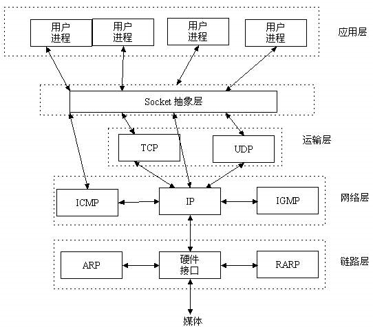
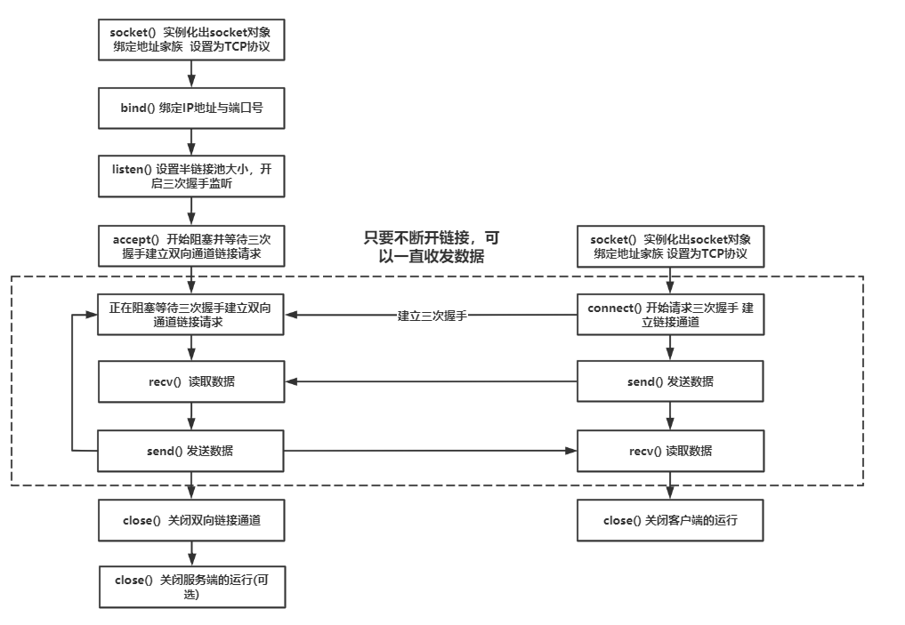
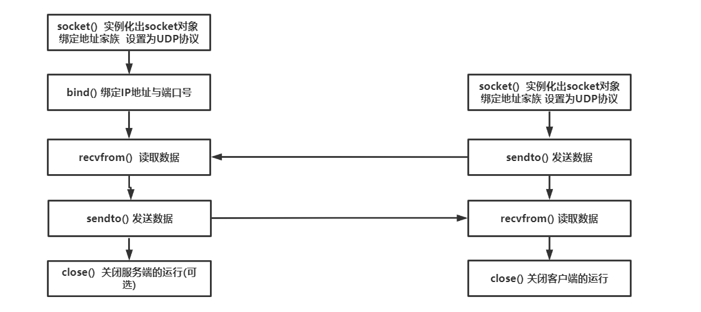
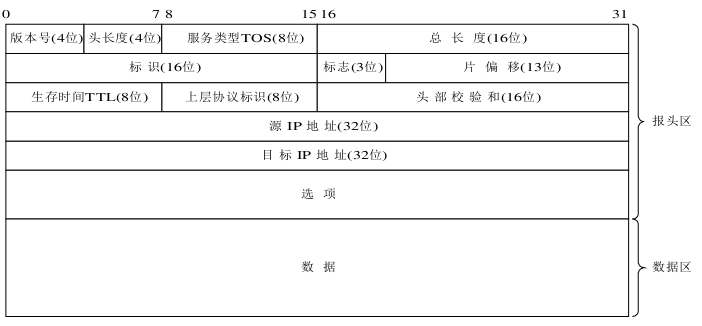
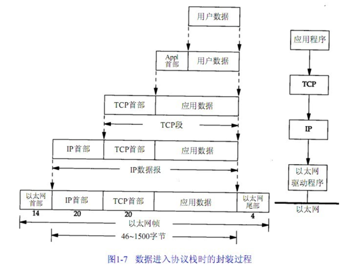

## Socket初探

为了实现以下功能

> 捕获本机网卡的IP包，对捕获的IP包进行解析。
> 要求必须输出以下字段：版本号、总长度、标志位、片偏移、协议、源地址和目的地址。

我第一反应就是Python应当有这么一个库可以直接调用，那问题就解决了，通过scapy的确可以实现，代码如下

```python
#通过scapy来获取本机对应网卡的IP报文
from scapy.all import *
import time
a = []
def pack_callback(packet):
    try:
        if (packet[6].name == 'IP'):
            temp = []
            temp.append(packet[0].payload.payload.payload.payload.payload.payload.version)
            temp.append(packet[0].payload.payload.payload.payload.payload.payload.ihl)
            temp.append(packet[0].payload.payload.payload.payload.payload.payload.tos)
            temp.append(packet[0].payload.payload.payload.payload.payload.payload.len)
            temp.append(packet[0].payload.payload.payload.payload.payload.payload.id)
            temp.append(packet[0].payload.payload.payload.payload.payload.payload.flags)
            temp.append(packet[0].payload.payload.payload.payload.payload.payload.frag)
            temp.append(packet[0].payload.payload.payload.payload.payload.payload.ttl)
            temp.append(packet[0].payload.payload.payload.payload.payload.payload.proto)
            temp.append(packet[0].payload.payload.payload.payload.payload.payload.chksum)
            temp.append(packet[0].payload.payload.payload.payload.payload.payload.src)
            temp.append(packet[0].payload.payload.payload.payload.payload.payload.dst)
            a.append(temp)
            print(temp)
    except:pass
    
filterstr="" 
#关于sniff的prn参数  指定回调函数，每当一个符合filter的报文被探测到时，就会执行回调函数
#iface参数 用来指定要在哪个网络接口上进行抓包 如若不指定即所有网络接口
# count指定最多嗅探多少个报文（是指符合filter条件的报文，而非所有报文）
sniff(filter=filterstr,prn=pack_callback, iface=' ', count=0)
```

但这样的实现其实是抓取到了很多信息，通过设定prn对抓取到的信息进行处理提取出我们想要的。那如何才能对IP包进行直接抓取，这就需要用到socket了。

##### 以下是本人对socket的理解，并不确保完全正确。

### 何为socket

> A **network socket** is a software structure within a network node of a computer network that serves as an endpoint for sending and receiving data across the network.      ——[Wikipedia](https://en.wikipedia.org/wiki/Network_socket)

前半句话难以理解甚至于比较抽象，但后半句其实说明了Socket即**端**，**端作为网络通信的起点或者终点而存在**。基于socket去获取信息，我们可以不用了解链路中间发生了什么，信息是如何传输的，但我们知道通过socket就是可以得到信息。它就像是API调用就好，可以输出我们想要的，而不必关注它中间做了多复杂的操作。

调用API你需要去传入参数，socket可以说是操作系统提供的一套API。因此创建socket也要向操作系统提交需要创建的socket的信息，然后才能创建一个对应的socket。

<center>        <br>    <div style="color:orange; border-bottom: 1px solid #d9d9d9;    display: inline-block;    color: #999;    padding: 2px;">socket抽象层</div> </center>

#### socket的结构

一个socket至少包含以下内容

1. 本地socket地址：本地主机的ip+端口号。
2. 传输协议：例如TCP、UDP、raw IP等。

如果本地socket要与远程主机进行通信，则还有加上远程socket的地址，即远程主机的ip与端口号。

就如同两个人之间用手机进行通信，手机就是socket，它包含电话号码(即本地socket地址)，手机的通信协议(即传输协议)，如果要打电话，那需要对方的电话号码(即远程主机的socket地址)。类比到计算机网络环境，主机就如同人，socket就如同手机。我们并不需要知道拨打电话后发生了什么，我们只知道我们之间的通信建立成功了。

以上便是对socket的比喻描述，但可能并不是很恰当，因为socket创建中本地的socket地址是其固有属性，而电话号码是手机的一个附加属性。

#### socket的用法

当我们已经创建好socket之后，我们需要一些操作对socket进行配置，bind,listen,connect...

还是手机的例子，有了手机(有了socket)，首先要再本机的多个号码中配置要用的一个(为socket关联本地地址，bind)，要打电话就要输电话号码(与远程socket建立连接,connect)，接电话(accept)。

### socket的python实现

所以我们的目的其实就是创建socket，然后根据要求使用socket

#### 创建socket

```（
import socket
socket.socket(family=AF_INET, type=SOCK_STREAM, proto=0, fileno=None)
```

- `family`-用于指定socket的地址类型。常见由`AF-INET`和`AF-INET6`,分别表示IPv4和IPv6，AF即`Address Family`。
- `type`-用于指定socket类型。主要有以下类型
  1. `SOCK_STREAM`：使用TCP或STCP协议，面向连接的socket
  2. `SOCK_DGRAM`：使用UDP协议，面向无连接的socket
  3. `SOCK_RAW`：原始套接字。这类socket，数据包将绕过运输层，因此可以在应用层得到数据包的头部
- `proto`-协议号通常为零,可以省略。这相当于为指定协议在运输层打开一个缺口，从而在运输层放行该协议的包。IPPROTO_TCP 、 IPPROTO_IP 、IPPROTO_UDP代表三种不同的协议，分别代表IP协议族里面的TCP协议、IP协议和UDP协议。
- `fileno`-如果指定了fileno,则其他参数将被忽略,导致带有指定文件描述符的套接字返回。

#### 使用socket

关于socket的使用，按使用协议的不同可以分为TCP通信和UDP通信，按使用场景不同，又可以分为客户端与服务器端。

<center>        <br>    <div style="color:orange; border-bottom: 1px solid #d9d9d9;    display: inline-block;    color: #999;    padding: 2px;">基于TCP的socket通讯流程图</div> </center>

<center>        <br>    <div style="color:orange; border-bottom: 1px solid #d9d9d9;    display: inline-block;    color: #999;    padding: 2px;">基于UDP的socket通讯流程图</div> </center>

#### socket基本函数

- `socket.bind(adress)` - 该函数将socket绑定到一个地址上，为socket关联一个相应的IP和端口号。要注意2点：1. 一个socket只能绑定到一个地址上，不能重复绑定；2. 地址格式必须与创建socket时指定的一致，例如不能将INET socket绑定到INET6 socket上
- `socket.listen([backlog])` - 启动监听，即允许服务器接受连接。backlog参数用于指定最大连接数，一旦服务器达到最大连接数，之后的连接都将被拒绝。backlog参数的大小，决定了TCP服务器的连接请求队列大小，进一步影响客户端连接请求的成功与否。
- `socket.connect(address)` - 与远程socket建立连接。只有使用TCP才需要建立连接，UDP是无连接的。
- `socket.accept()` - 接受一个连接。其返回值是`(conn, address)`，其中conn是是一个新的socket对象，用于与建立连接的socket收发数据，address则作为远程socket地址绑定到该socket上。原始socket与主机的一个端口绑定，但并不意味着socket占用了该端口，而是向TCP\IP协议栈声明了其对80端口的占用。新创建的socket使用的端口是不变的，这并不意味着端口占用。而是因为**socket只是对TCP/IP协议栈操作的抽象，而不是简单的映射关系**。
- `socket.send(bytes)`/`socket.sendto(bytes[,flags], address)` - 向远程socket发送数据，注意，必须以bytes格式发送。而使用`sendto`时，要指名目的socket的地址。
- `socket.recv(bufsize[, flags])`/`socket.recvfrom(bufsize[, flags])` - 从socket接收数据，通过`bufsize`指定一次性接收数据的最大量，`recv`的返回值是bytes对象，而`recvfrom`的返回值是`(data, address)`，address即为发送数据的socket地址。

#### socket实现服务器端与客户端通信

```
# 服务器端
import socket
# 创建socket
with socket.socket(socket.AF_INET, socket.SOCK_STREAM) as s:
    s.bind(("127.0.0.1", 56789))  # 绑定地址，如前所述，socket地址由ip地址与port组成
    s.listen(1)  # 启动监听，并设置最大连接数为1
    conn, addr = s.accept()  # 接受连接，并将返回的新socket与addr info分别储存
    with conn:
        print('Connected by', addr)  # 在本地打印信息，测试用
        while True:
            data = conn.recv(65565)  # 65535是一次性能接收的最大值
            if not data:
                break
            conn.send(data)  # 将数据原样发回
            
            
#客户端
import socket
# 创建socket with socket.socket(socket.AF_INET, socket.SOCK_STREAM) as s:
    s.connect(("127.0.0.1", 56789))  # 连接到另一个socket     
    s.send(b'Hello, socket')  # 向对方socket发送数据     
    data = s.recv(65565)
print('Received', str(data))  # 打印收到的数据 
```

以上代码实现了在本机范围内的通信，修改IP为远程服务器IP即可与远程服务器建立连接。

### Package analyse

在此我们需要为设置socket的类型为原始套接字，并为其指定协议IPPROTO_TCP表明要抓取TCP协议报文。

```
#demo
s=socket.socket(socket.AF_INET, socket.SOCK_RAW, socket.IPPROTO_TCP)
    while True:
        print(s.recvfrom(65565))
```

recvfrom返回data和address。data部分由`IP header + TCP header + data`组成，于是我们基于对socket的理解，便可以着手去用socket抓取IP报文，并对IP报文报头进行分析。

<center>        <br>    <div style="color:orange; border-bottom: 1px solid #d9d9d9;    display: inline-block;    color: #999;    padding: 2px;">IP数据包格式</div> </center>

通过如下处理便可以得到IP报文首部的数据

```python
import socket
from struct import unpack
def start():
    s=socket.socket(socket.AF_INET, socket.SOCK_RAW, socket.IPPROTO_TCP)
    while True:
        raw_packet = s.recvfrom(65565)
        packet = raw_packet[0]
        raw_iph = packet[0:20]
        # unpack(fmt, buffer) - 根据指定的格式化字符串来拆解给定的buffer
        # B 单字节的整型
        # H 双字节的整型
        # s bytes，前加数字表示取4字节的bytes
        iph = unpack("!BBHHHBBH4s4s", raw_iph)
        fields = {}
        fields["Version"] = iph[0] >> 4    # 版本字段与IP数据报头部共享一个字节，通过右移操作取得单独的版本字段
        fields["IP Header Length"] = (iph[0] & 0xF) * 4    # 首部长度字段的1代表4个字节
        fields["Type of Service"] = iph[1]    # 区分服务，一般情况下并不使用
        fields["Total Length"] = iph[2]    # IP首部+数据的总长度，即len(packet)
        fields["Identification"] = iph[3]    # 标识
        flags = iph[4] >> 13    # 标识位与片偏移共享2个字节，且最高位并且未使用
        fields["MF"] = 1 if flags & 1 else 0    # 测试最低位
        fields["DF"] = 1 if flags & 1 else 0    # 测试中间位
        fields["Fragment Offset"] = iph[4] & 0x1FFF    # 位与操作取得片偏移
        fields["Time to Live"] = iph[5]    # 生存时间，单位是跳数
        fields["Protocol"] = iph[6]    # 数据报携带的数据使用的协议，TCP为6
        fields["Header Checksum"] = iph[7]    # 首部校验和
        # socket.inet_ntoa(..)
        # - convert an ip address from 32-bit packed binary format to string format
        fields["Source Address"] = socket.inet_ntoa(iph[8])
        fields["Destination Address"] = socket.inet_ntoa(iph[9])
```

通过上述代码的解析我们可以获取到IP首部，同理我们也可以去解析TCP首部。

我们为其指定协议为IPPROTO_TCP，可以获取TCP报文，但如果采用

```
socket.socket(socket.AF_PACKET, socket.SOCK_RAW, socket.ntohs(0x0003))
```

来创建socket，便可以获取信息更全面的数据包，`ethernet frame header + IP header+ inner-Protocol header+data`。再对各个部分进行切片操作，根据报文格式进行提取，就可以实现对本机所有以太网帧的捕获与分析了！

<center>        <br>    <div style="color:orange; border-bottom: 1px solid #d9d9d9;    display: inline-block;    color: #999;    padding: 2px;">数据报格式</div> </center>

### 总结

为了实现socket编程，起初尝试用C++完成任务，学习网上的代码如下

```c++
#define _CRT_SECURE_NO_WARNINGS
#define _WINSOCK_DEPRECATED_NO_WARNINGS
#include <iostream>
#include <winsock2.h>
#include <windows.h>
#include <string.h>
#include <mstcpip.h>
#include "IP_HEAD.h"
#pragma comment(lib,"Ws2_32.lib")
using namespace std;
int number;
int DecodeIP(char* buf, int len)
{
	int n = len;
	if (n >= sizeof(IP_HEAD))
	{
		IP_HEAD iphead;
		iphead = *(IP_HEAD*)buf;
		cout << "第 " << number++ << " 个IP数据包信息：" << endl;
		cout << "协议版本:" << (iphead.ver_hlen >> 4) << endl;
		cout << "总长度:" << ntohs(iphead.wPacketLen) << endl; //网络字节序转为主机字节序
		cout << "标志位:" << "DF=" << ((iphead.Flags >> 14) & 0x01) << ",MF=" << ((iphead.Flags >> 13) & 0x01) << endl;
		cout << "片偏移:" << (iphead.FragOf & 0x1fff) << endl;
		cout << "协议:" << int(iphead.byProtocolType) << endl;
		cout << "源地址:" << inet_ntoa(*(in_addr*)&iphead.dwIPSrc) << endl;
		cout << "目的地址:" << inet_ntoa(*(in_addr*)&iphead.dwIPDes) << endl;
		cout << "---------------------------------------------------" << endl << endl;
	}
	return 0;
}
void AutoWSACleanup()
{
	::WSACleanup();  // 终止Winsock的使用
}
int main()
{
	int n;
	WSADATA wd;  //一种数据结构,这个结构被用来存储被WSAStartup函数调用后返回的Windows Sockets数据,它包含Winsock.dll执行的数据。
	n = WSAStartup(MAKEWORD(2, 2), &wd);  //返回winsock服务初始化是否成功，若返回1则输出错误
	if (n)
	{
		cout << "WSAStartup函数错误！" << endl;
		return -1;
	}
	atexit(AutoWSACleanup);
	SOCKET sock = socket(AF_INET, SOCK_RAW, IPPROTO_IP);  //创建SOCKET
	if (sock == INVALID_SOCKET)
	{
		cerr << WSAGetLastError();
		return 0;
	}
	//获取本机地址
	char  name[128];
	if (-1 == gethostname(name, sizeof(name)))
	{
		closesocket(sock);
		cout << WSAGetLastError();
		return 0;
	}
	struct hostent* pHostent;
	pHostent = gethostbyname(name);
	//绑定本地地址到SOCKET
	sockaddr_in addr;
	addr.sin_family = AF_INET;
	addr.sin_addr = *(in_addr*)pHostent->h_addr_list[0]; //IP
	addr.sin_port = 8888; //端口，IP层端口可随意填
	if (SOCKET_ERROR == bind(sock, (sockaddr*)&addr, sizeof(addr)))
	{
		closesocket(sock);
		cout << WSAGetLastError();
		return 0;
	}
	//设置该SOCKET为接收所有流经绑定的IP的网卡的所有数据，包括接收和发送的数据包
	u_long sioarg = 1;
	DWORD wt = 0;
	if (SOCKET_ERROR == WSAIoctl(sock, SIO_RCVALL, &sioarg, sizeof(sioarg), NULL, 0, &wt, NULL, NULL))
	{
		closesocket(sock);
		cout << WSAGetLastError();
		return 0;
	}
	//我们只需要接收数据，因此设置为阻塞IO，使用最简单的IO模型
	u_long bioarg = 0;
	if (SOCKET_ERROR == ioctlsocket(sock, FIONBIO, &bioarg))
	{
		closesocket(sock);
		cout << WSAGetLastError();
		return 0;
	}
	//开始接收数据
	//因为前面已经设置为阻塞IO，recv在接收到数据前不会返回。
	number = 1;
	char buf[65535];
	int len = 0;
	do
	{
		len = recv(sock, buf, sizeof(buf), 0);
		if (len > 0)
		{
			DecodeIP(buf, len);
		}
	} while (len > 0);
	closesocket(sock);
	return 0;
}
```

后来尝试用Python的socket模块进行编程，但是socket在Windows环境下不时出现Winerror，windows下基于python的socket编程资料也比较少，很难以解决，最后转向Linux。我推测原因在于Windows下对于socket的操作函数已经传入的参数设置可能于Linux存在不同，因而产生报错。在虚拟机Ubuntu20.04的开发环境完成程序的编写以及界面的编写。

关于软件的代码见https://github.com/gorgeousdays/Package-analyse。存在诸多bug，由于在windows环境下测试不了，在Ubuntu虚拟机下测试性能太差，很难对代码进行Debug。

目前问题：

1. 只能抓包一次，即需要的socket的创建进行控制。
2. 关于过滤器的编写，实现对抓取到的报文的过滤操作
3. 优化问题，实现对TCP首部的分析，实现对所有报文的抓取分析以及过滤。

### 参考链接

https://www.cnblogs.com/charlesblc/p/6235437.html

https://www.cnblogs.com/riacool/archive/2010/12/14/1905404.html

https://www.cnblogs.com/yunya-cnblogs/p/13198409.html

https://www.youtube.com/watch?v=r59LJARW8hU

https://blog.kissg.me

https://realpython.com/python-sockets/

http://www.steves-internet-guide.com/tcpip-ports-sockets/#comment-1821

