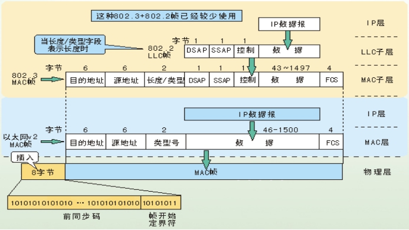
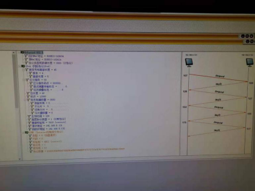

## 以太网数据帧的构成

### 一、实验目的

1. 掌握以太网的报文格式；

2. 掌握MAC地址的作用；

3. 掌握MAC广播地址的作用；

4. 掌握仿真编辑器和协议分析器的使用方法。

### 二、实验原理

一、两种不同的MAC帧格式
   常用的以太网MAC帧格式有两种标准，一种是DIX Ethernet V2标准；另一种是IEEE的802.3标准。 目前MAC帧最常用的是以太网V2的格式。下图画出了两种不同的MAC帧格式。

 

二、MAC层的硬件地址 

1. 在局域网中，硬件地址又称物理地址或MAC地址，它是数据帧在MAC层传输的一个非常重要的标识符。 

2. 网卡从网络上收到一个 MAC 帧后，首先检查其MAC 地址，如果是发往本站的帧就收下；否则就将此帧丢弃。这里“发往本站的帧”包括以下三种帧：

-  单播(unicast)帧（一对一），即一个站点发送给另一个站点的帧。

-  广播(broadcast)帧（一对全体），即发送给所有站点的帧(全1地址)。

-  多播(multicast)帧（一对多），即发送给一部分站点的帧。 

 

### 三、实验步骤

#### 3.1 实验拓扑结构

采用以下网络结构

 

#### 3.2实验练习

##### 练习一：领略真实的MAC帧

本练习将主机A和B作为一组，主机C和D作为一组，主机E和F作为一组。现仅以主机A和B为例，说明实验步骤。 

1. 主机B启动协议分析器，新建捕获窗口进行数据捕获并设置过滤条件（提取ICMP协议）。 

2. 主机A ping主机B；察看主机B协议分析器捕获的数据包，分析MAC帧格式。 

3. 将主机B的过滤器恢复为默认状态。 

4. 将主机B、D、F的过滤器恢复为默认状态。

 

 

我们发现在ping请求后，A，B主机均侦听到了ICMP数据报。且MAC帧中封装了IP和ICMP数据报。

 

##### 练习二：理解MAC地址的作用

本练习将主机A和B作为一组，主机C和D作为一组，主机E和F作为一组。现仅以主机A、B为例，其它组的操作参考主机A、B的操作。

1. 主机B启动协议分析器，打开捕获窗口进行数据捕获并设置过滤条件（源MAC地址为主机A的MAC地址）。
2. 主机Aping主机B。

3. 主机B停止捕获数据，在捕获的数据中查找主机A所发送的ICMP数据帧，并分析该帧内容。

|       | 本机MAC地址       | 报文源MAC地址     | 报文目的MAC地址   |
| ----- | ----------------- | ----------------- | ----------------- |
| 主机B | EO-BE-03-16-D5-F1 | EO-BE-03-16-D6-5A | EO-BE-03-16-D5-F1 |
| 主机D | E0-BE-03-16-D5-AF | E0-BE-03-16-E1-E6 | E0-BE-03-16-D5-AF |

 

##### 练习三：编辑并发送MAC广播帧

1. 主机E启动仿真编辑器。 

2. 主机E编辑一个MAC帧，
   目的MAC地址：FFFFFF-FFFFFF。
   源MAC地址：主机E的MAC地址。
   协议类型或数据长度：大于0x0600。
   数据字段：编辑长度在46—1500字节之间的数据。 

3. 主机A、B、C、D、F启动协议分析器，打开捕获窗口进行数据捕获并设置过滤条件（源MAC地址为主机E的MAC地址）。 

4. 主机E发送已编辑好的数据帧。 

5. 主机A、B、C、D、F上停止捕获数据，察看捕获到的数据中是否含有主机E所发送的数据帧。 

-  结合练习二的实验结果，简述FFFFFF-FFFFFF作为目的MAC地址的作用。

​        因为A、B、C、D、F都收到E发送的MAC帧，说明FF-FF-FF-FF-FF-FF是一个全局广播地址。即此地址将不会被交换机过滤。

###  

##### 练习4：编辑并发送LLC帧

本练习将主机A和B作为一组，主机C和D作为一组，主机E和F作为一组。现仅以主机A、B所在组为例，其它组的操作参考主机A、B所在组的操作。

1. 主机A启动协议编辑器，并编写一个LLC帧。
   目的MAC地址：主机B的MAC地址
   源MAC地址：主机A的MAC地址
   协议类型和数据长度：001F
   控制字段：填写02（注：回车后变成0200，该帧变为信息帧，控制字段的长度变为2字节）
   用户定义数据/数据字段：AAAAAAABBBBBBBCCCCCCCDDDDDD（注：长度为27个字节）
2. 主机B启动协议分析器并开始捕获数据。
3. 主机A发送编辑好的LLC帧。

4. 主机B停止捕获数据，在捕获到的数据中查找主机A所发送的LLC帧，分析该帧内容。

●记录实验结果

表1-4实验结果

| 帧类型 | 发送序号N（S） | 接受序号N（R） |
| ------ | -------------- | -------------- |
| LLC帧  | 0000001        | 0000000        |

5. 将第1步中主机A已编辑好的数据帧修改为“无编号帧”(前两个比特位为1)，用户定义数据/数据字段修改为AAAAAAABBBBBBBCCCCCCCDDDDDDD（注：长度为28个字节），重做第2、3、4步。

●简述“协议类型和数据长度”字段的两种含义。

​        协议类型是网络适配器向网络中发送数据时候所使用的格式，数据长度是主机一次能处理的数据长度。

 

#### 3.3思考问题

##### 练习二问题：

1. MAC地址应用与TCP/IP协议模型的哪一层？

  数据链路层

2. 如何区分以太网的两种标准帧格式

  两种格式的帧可以依据协议类型和数据长度字段的值进行区分，如果此帧是DIX Ethernet V2标准格式的帧，则协议类型或者数据长度字段的值大于1536B；如果此帧是IEEE 802.3标准格式的帧，则协议类型或数据长度字段的值小于1518B。

 

  

##### 练习三问题：

1. 主机A、B、C、D、F是否可以收到主机E的广播帧？
   可以收到
2. 说明MAC广播帧的范围？
   同一局域网下的所有主机

 

练习四问题：

1. 如何编辑LLC无编号帧和LLC数据帧。

​       通过控制字段编辑 0200为LLC数据帧，03位LLC无编号帧

 

2. 在协议分析端捕获到该帧，该帧的长度是多少？由此理解以太网的最短帧长度、

​       长度为60，由此以太网最短帧长度为64比特

3. 为什么IEEE802标准将数据链路层分割为MAC子层和LLC子层？

​        MAC子层主要用于直接和物理层进行对接，其封装了数据链路层确定链路最核心的细节，将实现细节向上级(网络层)隐藏。同时，LLC基于MAC协议实现逻辑链路控制(LCP)和网络控制(NCP)，向上级提供了接口，实现必要的网络连接所需要的功能。将一个问题划分为两部分便于实现。

 

4. 为什么以太网有最短帧长度的要求？

  为了确定是否发生冲突。 

 

### 四、实验总结

1. MAC地址有48bit，其中第8个比特为0的为单播地址，为1的为多播地址，全为1(即为FF-FF-FF-FF-FF-FF)为广播地址。

2. ICMP是IP协议的一个组成部分，主要为判断网络的连接状况提供协议支持。

3. 共享链路不具备筛选MAC地址作用，而交换机则可以识别源地址和目标地址，从而向正确的网络接口转发数据。