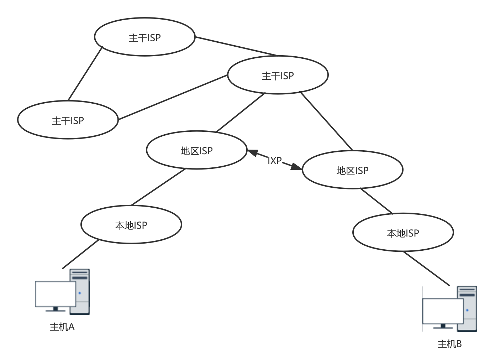

### 计算机网络(概述)

***

#### 1.1 计算机网络在信息时代的作用

三类网络: 电信网络 有限电视网络 计算机网络

三网融合: Internet(即因特网、互联网)

互联网的两个重要基本特点:**连通性** **共享**

#### 1.2 互联网概述

**网络**(即计算机网络)=结点(node)+链路(link)
其中结点可以是计算机、集线器、交换机或路由器等

网络+路由器+网络=**互连网**
路由器实现网络间的互连 互连网也称“网络的网络”

**主机**:与网络相连的计算机

互联网的发展历史:
ARPANET向互联网发展(1983年TCP/IP协议称为ARPANET上的标准协议)
三级结构的互联网(NSFNET 分为主干网、地区网和校园网(或企业网))
多层次ISP结构的互联网(NSFNET被替代 互联网服务提供者ISP出现)

**ISP**

互联网服务提供商 ISP 可以从互联网管理机构获得许多 IP 地址，同时拥有通信线路以及路由器等联网设备，个人或机构向 ISP 缴纳一定的费用就可以接入互联网。

ISP分为不同层次的ISP:主干ISP、地区ISP和本地ISP

**互联网交换点IXP**允许两个网络直连并交换分组，有效利用网络资源

**互联网协会ISOC**下设一个技术组织**互联网体系结构委员会IAB**，负责互联网有关协议的开发。IAB下设两个工程部：**互联网工程部IETF**(针对协议的开发和标准化)和**互联网研究部IRTF**(研究互联网的一些协议、应用、体系结构等)

互联网标准的建立过程:"建议标准"->"互联网标准"

#### 1.3 互联网的组成

互联网从**工作方式**上划分:**边缘部分**(由所有连接在互联网上的主机组成。这部分用户直接使用的，用来进行通信和资源共享)和**核心部分**(由大量网络和连接这些网络的路由器组成。这部分是为边缘部分提供连通性和交换服务的)

**计算机通信:主机A的某个进程和主机B上的另一个进程进行通信**

边缘部分:主机(即端系统)之间的通信方式：

- 客户-服务器方式(C/S方式):客户是服务的请求方，服务器是服务的提供方。
- 对等方式(P2P方式):不区分客户和服务器。

核心部分:路由器起特殊作用

- 电路交换:用于电话通信系统，且用户间通信需要一条专用的物理通路，且在整个通信过程中始终占用该链路。由于通信的过程中不可能一直在使用传输线路，因此电路交换对线路的**利用率很低**，往往不到 10%甚至1%。
- 分组交换:采用存储转发技术。**分组**(又称为包)是互联网中传送的数据单元 ，每个分组都有首部和数据，首部包含了诸如目标地址和源地址等重要控制信息。分组交换不必先占用一条端到端的链路的通信资源，即在同一条传输线路上允许同时传输多个分组。

电路交换——整个报文的比特流连续地从源点直达终点，好像在一个管道中传送。 
报文交换——整个报文先传送到相邻结点，全部存储下来后查找转发表，转发到下一个结点。 
分组交换——单个分组（这只是整个报文的一部分）传送到相邻结点，存储下来后查找转发表，转发到下一个结点 

#### 1.4 计算机网络在我国的发展

1980年铁道部开始进行计算机联网实验。

1989年11月我国第一公用分组交换网CNPAC建成运行。

目前我国规模最大的五个公用计算机网络:

1. 中国电信互联网CHINANET(也就是原来的中国公用计算机互联网)
2. 中国联通互联网UNINET
3. 中国移动互联网CMNET
4. 中国教育和科研计算机网CERNET
5. 中国科学技术网CSTNET

#### 1.5 计算机网络的类别

按照网络的作用范围分:

1. 广域网WAN
2. 城域网MAN
3. 局域网LAN
4. 个人区域网PAN

按网络的使用者分:

1. 公用网
2. 专用网

用来把用户介入到互联网的网络:接入网，既不属于核心部分也不属于边缘部分

#### 1.6 计算机网络的性能

**性能指标**:

1. 速率 数据的传送速率，它也称为数据率或比特率 速率单位bit/s 当提到网络的速率时，往往指的是**额度速率**或**标称速率**，而并非网络实际上运行的速率。

2. 带宽 某信道允许通过的信号频带范围称为该**信道的带宽**(频域)。在计算机网络中，带宽表示网络中某**通道**传送数据的能力(时域)，网络带宽表示在单位时间内网络的某信道所能通过的**“最高数据率”**，单位为“比特每秒”。

3. 吞吐量 在单位时间内通过某个网络的实际的数据量。额定速率为吞吐量的决定上限值，对1Gbit/s的以太网，其实际的吞吐量可能只有100Mbit/s

4. 时延 总时延 = 排队时延 + 处理时延 + 传输时延 + 传播时延

   发送时延：主机或路由器传输数据帧所需要的时间，也称传输时延
   $$
   delay=\frac{l(bit)}{v(bit/s)}
   $$
   ​             其中 l 表示数据帧的长度，v 表示传输速率。

   传播时延：电磁波在信道中传播所需要花费的时间，电磁波传播的速度接近光速。
   $$
   delay=\frac{l(m)}{v(m/s)}
   $$
   ​             其中 l 表示信道长度，v 表示电磁波在信道上的传播速度。

   处理时延：主机或路由器收到分组时进行处理所需要的时间，例如分析首部、从分组中提取数据、进行差错检验或查找适当的路由等。

   排队时延：分组在路由器的输入队列和输出队列中排队等待的时间，取决于网络当前的通信量。

5. 时延带宽积 传播时延$$\times$$带宽 时延带宽积又称为**以比特为单位的链路长度**

6. 往返时间RTT 双向交互一次的时间

7. 利用率 有信道利用率(信道有百分之几的时间是被利用的)和网络利用率(全网络的信道利用率的加权平均值)。信道利用率并非越高越好(排队论)。

**非性能指标**:费用、质量、标准化、可靠性、可扩展性和可升级性、易于管理和维护

#### 1.7 计算见网络体系结构

五层协议:

- 应用层

  通过应用进程间的交互来完成特定的网络应用。为特定应用程序提供数据传输服务，例如 HTTP、DNS 等协议。数据单位为报文。

- 运输层 

  为进程提供通用数据传输服务。运输层主药使用两种协议：传输控制协议 TCP，提供面向连接、可靠的数据传输服务，数据单位为报文段；用户数据报协议 UDP，提供无连接、尽最大努力的数据传输服务，数据单位为用户数据报。TCP 主要提供完整性服务，UDP 主要提供及时性服务。

- 网络层

  为主机提供数据传输服务。而传输层协议是为主机中的进程提供数据传输服务。网络层把传输层传递下来的报文段或者用户数据报封装成分组。网络层也称网际层或IP层。

- 数据链路层

  网络层针对的还是主机之间的数据传输服务，而主机之间可以有很多链路，链路层协议就是为同一链路的主机提供数据传输服务。数据链路层把网络层传下来的分组封装成帧。

- 物理层

  考虑的是怎样在传输媒体上传输数据比特流，而不是指具体的传输媒体。双绞线、同轴电缆等物理媒体当做第0层。

OSI:表示层负责数据压缩、加密以及数据描述，会话层负责建立及管理会话。在五层协议中这些功能留给应用程序开发者处理。

TCP/IP:相当于五层协议中数据链路层和物理层合并为网络接口层。TCP/IP 体系结构不严格遵循 OSI 分层概念，应用层可能会直接使用 IP 层或者网络接口层。

数据在各层的传输:

- 在向下的过程中，需要添加下层协议所需要的首部或者尾部，而在向上的过程中不断拆开首部和尾部。
- 路由器只有下面三层协议，因为路由器位于网络核心中，不需要为进程或者应用程序提供服务，因此也就不需要传输层和应用层。